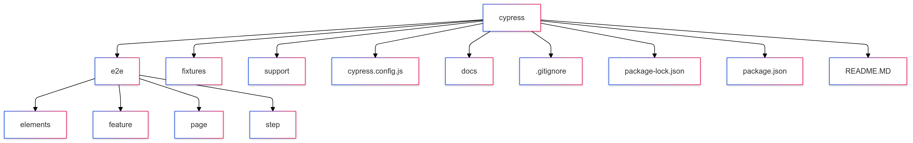

#### To be continued

I am currently taking a course to specialize in Cypress. The course covers comprehensive E2E testing, Web Apps, Automated API testing, ViewPort for mobile, Cloud and TestOps, Components, Jenkins, Docker, and maps and geolocation. However, the course does not utilize Cucumber. Therefore, in parallel, I am working on this project, applying all the concepts from the course while incorporating Cucumber. Additional updates to the README will be made throughout the project.

## Directory Architecture

| Structure                       | Description                                         |
| ------------------------------- | --------------------------------------------------- |
| / - /`cypress`                  | Main Cypress folder for E2E testing.                |
| / - / - /`e2e`                  | Contains End-to-End tests organized in subfolders.  |
| / - / - / - / `elements`        | Defines the element selectors for the tests.        |
| / - / - / - / `feature`         | Contains `.feature` files for the tests.            |
| / - / - / - / `page`            | Contains page with reusable methods.                |
| / - / - / - /`step`             | Defines the Cucumber steps for the tests.           |
| / - / - / `fixtures`            | Contains static data used in the tests.             |
| / - / - / `support`             | Support scripts, such as custom commands.           |
| / - / `.gitignore`              | Lists files and folders to be ignored by Git.       |
| / - / `cypress.config.js`       | Cypress configuration file                          |
| / - / `package-lock.json`       | File that locks npm dependencies versions.          |
| / - / `package.json`            | Contains project dependencies and scripts.          |
| / - / `README.MD`               | Project description, instructions, and information. |

## Folder Diagram

### Tools and Patterns

-   
-   
-   
-   **Page Objects Model**
